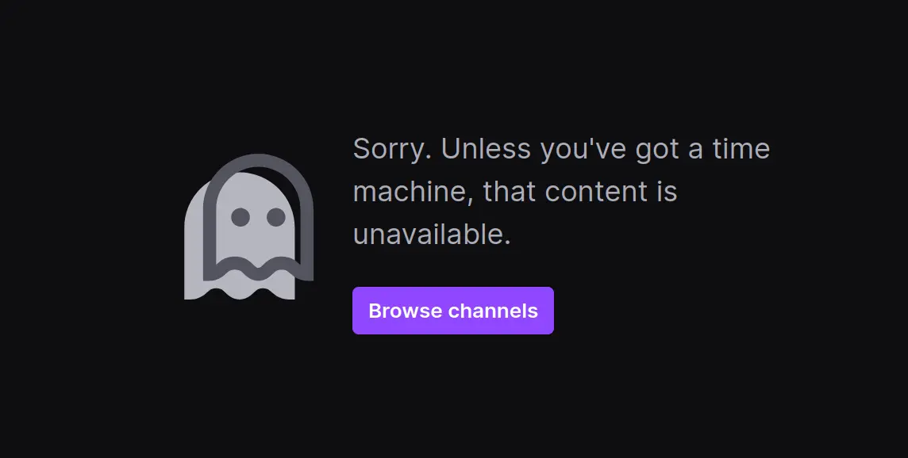

So there I was, messing around with GitHub Copilot on the web. I am familiar with web development so I got kinda curious how the API is structured. If only I can expose an OpenAI compatible chat completion endpoint...

I opened up the DevTools and immediately noticed that GitHub had completely abstracted away the OpenAI chat completion endpoint. Duh, of course they did! They're not gonna let us mess around with it that easily.


## The Spark

Then something interesting happened. I was watching Cassidy Williams on Twitch (she was talking about GitHub Copilot competition on dev.to). She showed off Copilot custom instructions. My mind immediately went: "WAIT A MINUTE... how is VSCode actually sending these custom instructions???"

(Sorry, the recording is gone now)



## Down the Rabbit Hole

Being a web dev, I'm used to just opening DevTools and calling it a day. But this was different - I needed to capture system-wide network requests. So how should I do it?

First stop: [Wireshark](https://gitlab.com/wireshark/wireshark)!

I heard people using it to capture network or packets or something similar to that. Sounds promising. I tried it for like 30 minutes and... NOPE. Turns out Wireshark can't capture HTTPS requests. At this moment I realized what the S in HTTPS stands for. Secure.

What I wanted to do was basically Man in the Middle attack. No no for HTTPS.

HOLD ON. Man in the middle... THAT'S IT!

Enter [mitmproxy](https://github.com/mitmproxy/mitmproxy) - this beautiful Python program can act as a proxy and logs all network requests. It even comes with a devtool like web UI. Just what I needed.

## The Authentication Nightmare

My first brilliant idea to make the whole thing automatic was to launch both the proxy and VSCode as Node.js child processes, then parse mitmproxy's output to get the authentication token.

It was not, in fact, brilliant.

I asked my friend to try the projecstandard github auth tokent and it was a mess. He didn't have mitmproxy installed. He didn't really know how to setup a proxy. There was also the whole thing where VSCode won't make any request because the proxy certificate wasn't valid or something.

After that spectacular failure, I did some digging and discovered VSCode was just using stock [standard github auth token](https://github.blog/engineering/platform-security/behind-githubs-new-authentication-token-formats). Specifically, VSCode uses `gho_xxx` token, which is the type of token used for OAuth apps.

Only after that then the `gho` token is used for getting the actual Copilot Chat completion token. Sounds complicated? Yeah because it is.

After finding that out, of course the next idea that came to my mind was "create a custom oauth app, get user token, get copilot token, bada bing bada boom we're cookin"

```
404 Not Found
```

WHAT THE HELL GITHUB??? YOU LIAR! THE ENDPOINT DOES EXIST. DONT GIVE ME THAT CODE.

Turns out Copilot's API internals are only exposed to OAuth tokens from VSCode.

But then... WAIT A SECOND! VSCode has its own device flow authentication! If I could just get VSCode's client ID...

IT WORKS!

## Building the Proxy Server

Now came the fun part - actually building the API server. I decided to start simple and disabled streaming at first, just emulating the streaming part in my server.

I primarily wanted to test the API with these three tools:

- Cline
- Aider
- bolt.diy

Cline immediately threw some weird "can't read undefined index 0" error and I went slightly insane trying to debug it. I even tried diving deep into Cline codebase, just for it to not result to anything.

After a good night's sleep, I realized Hono automatically adds "\[DONE\]" event in the stream. I didn't realize that and added another "\[DONE\]". Wow, this pains me physically.

Fixed that and Cline now works baby!

## Cline

I tried playing around with it using GPT-4o. But I remembered Cline is advertised to work best with Claude 3.5 Sonnet.

So I tried that and get a new error.

And this time, there wasn't even a single error message. The error wasn't even from Cline itself. The error was from GitHub Copilot internal API.

I tried comparing everything. The prompts, the request, the response. Everything is the same except the model. So I just concluded that the prompt was too long and the max context length for Claude provided by GitHub just wasn't enough. Because it is long, just look at this.

## Aider

Aider worked immediately! WITH CLAUDE AS WELL!

...until it didn't.

Random errors sometimes popped up and I didn't know why. Commit command also wasn't working.

The only things those two have in common that I know was those two tasks use the "weak" model in aider settings.

I was losing my mind again. I've double, hell even 10+ times checked to make sure that my API is structured the same as OpenAI.

I gave up and decided to open an issue.

No updates...

I just gonna write the result of my tests here

(realizes o1 doesn't support streaming)

THEN IT HIT ME.

THE WEAK MODEL EXPECTS NON-STREAMING RESPONSE.

My server didn't support non-streaming response. What an irony since I always disabled streaming internally and even emulated streaming response.

Might as well start implementing actual streaming now.

## bolt.diy

This thing just works baby!

Except that one issue but that's on bolt.diy itself and not me.

THE SERVER IS FEATURE COMPLETE!

## The Humbling Reality Check

So there I was, feeling like a genius, ready to write this blog post about my AMAZING DISCOVERY...

...only to find out that thousands (not really) of other developers had already done this exact thing.

But you know what? That's okay! I learned a ton of things.

Also, reverse engineering is fun!

## The Takeaway

I'm actually using this setup daily with Aider now (Cline still doesn't work, I'll probably fork it with shorter prompt). And while I wasn't the first person to figure this out, the journey was worth it.

Remember: don't be discouraged when you discover others have already built what you're building. The learning experience is what matters!

_obligatory disclaimer: This is all for educational purposes only. Please don't sue me, GitHub!_
