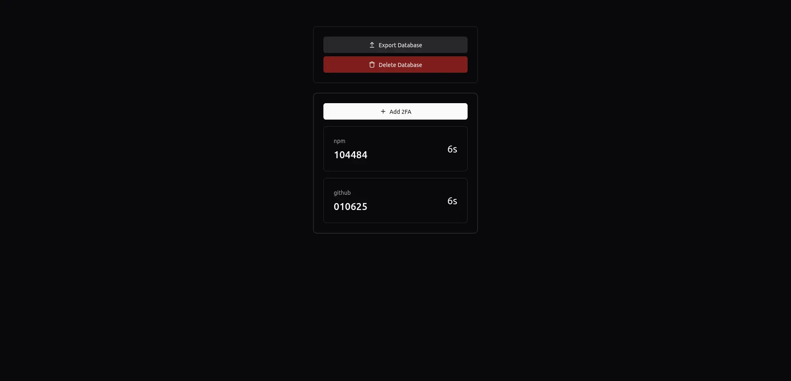

Winner of [Baparekraf Digital Talent 2024 - Upaya Keamanan Siber dan Ketahanan Digital](https://www.dicoding.com/challenges/902)

The following text are literally copied and pasted from my hackathon submission

---

## Ideas and Innovation

Twofactr is an innovative two-factor authentication application with a unique approach:

- Web-based application, eliminating the need for software installation
- User data export/import features for flexible synchronization
- Local data storage on user devices instead of centralized servers
- Password-based data encryption for maximum security

## Design and Usability

Twofactr is a simple and user-friendly two-factor authentication application that works across all devices. As a web application, users don't need to install any software beforehand.

The application has four main pages:

- /setup: The page where users first set up their password to encrypt the database. Users will be directed here if they haven't created a database before.
- /login: Users can log in here to access their TOTP list.
- / (Homepage): Users can view all their TOTPs here. Export/import data buttons are also available. Right-click or hold to delete items.
- /add: Users can add new TOTPs here. Users can add through QR code (camera/photo upload), or manually add with the secret provided by the TOTP provider.

## Screenshots

